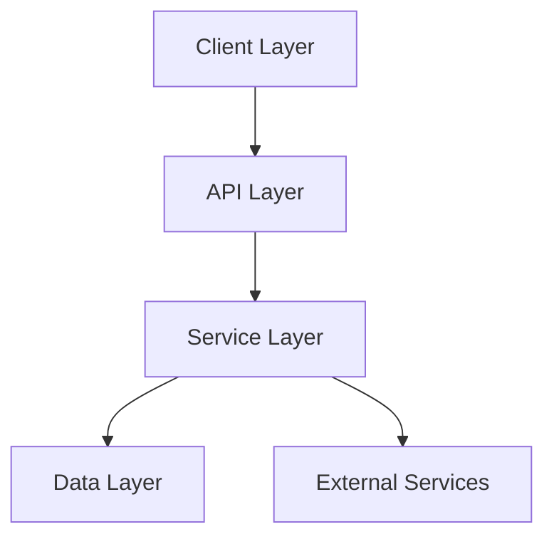
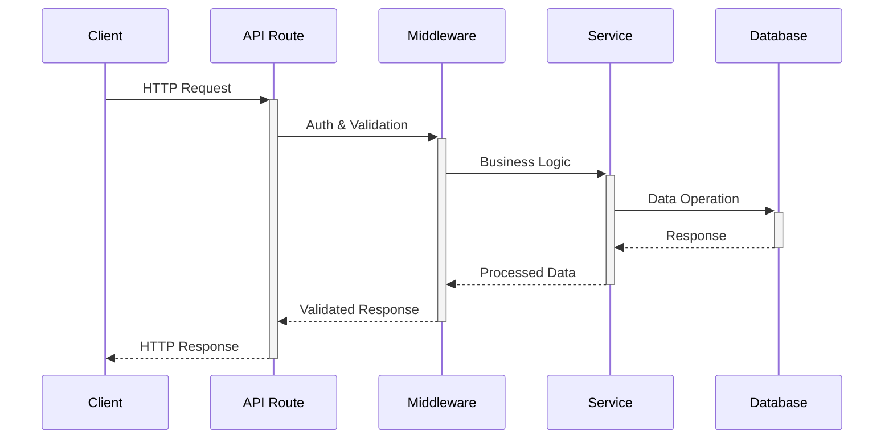
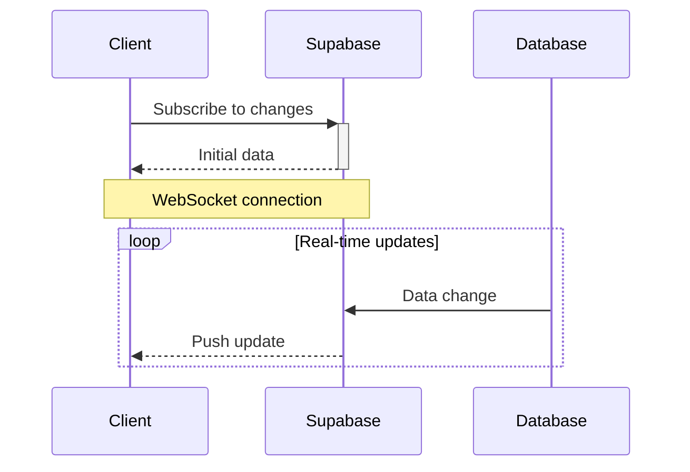
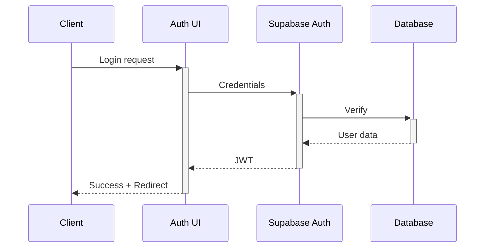
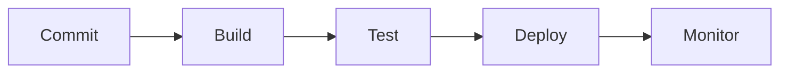
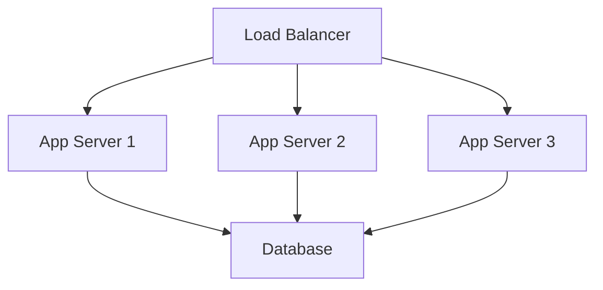

# Sylo Technical Architecture

## System Overview

Sylo follows a modular, scalable architecture designed for maintainability and performance.

> **Note:** The Sylo-core AI orchestration engine serves as the central command dispatcher, providing agentic control over all core platform functions. For detailed information, see [Sylo-core Documentation](./sylo-core.md).




## Core Architecture

### Frontend Architecture
```
src/
├── app/                 # Next.js app router
├── components/          # React components
│   ├── ui/             # Base UI components
│   ├── features/       # Feature-specific components
│   └── layouts/        # Layout components
├── lib/                # Shared utilities
├── hooks/              # Custom React hooks
├── contexts/           # React contexts
├── services/           # API service layers
└── types/              # TypeScript types
```

### Backend Architecture
```
src/
├── api/                # API routes
├── database/           # Database operations
├── services/           # Business logic
├── utils/             # Utility functions
└── middleware/        # API middleware
```

## Technology Stack

### Frontend
- **Framework**: Next.js 15 with React 19
- **State Management**: React Context + SWR
- **UI Components**: Shadcn UI
- **Styling**: Tailwind CSS
- **Forms**: React Hook Form + Zod
- **Testing**: Jest + React Testing Library

### Backend
- **API**: Next.js API Routes (Edge Runtime)
- **Database**: PostgreSQL via Supabase
- **Authentication**: Supabase Auth
- **File Storage**: Supabase Storage
- **Caching**: Vercel Edge Cache

### Infrastructure
- **Hosting**: Vercel
- **CDN**: Vercel Edge Network
- **Database**: Supabase
- **CI/CD**: GitHub Actions
- **Monitoring**: Vercel Analytics + Custom

## Core Systems

### 1. Authentication System
```typescript
interface AuthConfig {
  providers: ['email', 'google'];
  roles: ['admin', 'designer', 'client'];
  permissions: {
    projects: ['create', 'read', 'update', 'delete'];
    materials: ['create', 'read', 'update', 'delete'];
    clients: ['create', 'read', 'update', 'delete'];
  };
}
```

### 2. Project Management System
```typescript
interface Project {
  id: string;
  name: string;
  clientId: string;
  status: ProjectStatus;
  timeline: Timeline;
  team: TeamMember[];
  tasks: Task[];
  materials: Material[];
  budget: Budget;
}
```

### 3. Material Library System
```typescript
interface Material {
  id: string;
  name: string;
  category: MaterialCategory;
  specifications: MaterialSpecs;
  supplier: Supplier;
  pricing: PricingInfo;
  sustainability: SustainabilityMetrics;
  samples: Sample[];
}
```

### 4. Client Portal System
```typescript
interface ClientPortal {
  projects: Project[];
  approvals: Approval[];
  communications: Communication[];
  files: SharedFile[];
  preferences: ClientPreferences;
}
```

## Data Flow Architecture

### 1. Request Flow


### 2. Real-time Updates


## Security Architecture

### 1. Authentication Flow


### 2. Authorization System
```typescript
interface SecurityConfig {
  authentication: {
    providers: AuthProvider[];
    session: SessionConfig;
    mfa: MFAConfig;
  };
  authorization: {
    rbac: RBACConfig;
    policies: PolicyConfig[];
  };
  encryption: {
    atRest: EncryptionConfig;
    inTransit: EncryptionConfig;
  };
}
```

## Performance Architecture

### 1. Caching Strategy
```typescript
interface CacheConfig {
  edge: {
    ttl: number;
    rules: CacheRule[];
  };
  browser: {
    revalidation: RevalidationStrategy;
    persistence: CachePersistence;
  };
  api: {
    rateLimit: RateLimitConfig;
    caching: APICacheConfig;
  };
}
```

### 2. Performance Optimization
- Static page generation
- Dynamic imports
- Image optimization
- Edge caching
- API response compression

## Monitoring Architecture

### 1. Application Monitoring
```typescript
interface MonitoringConfig {
  metrics: {
    performance: PerformanceMetrics;
    errors: ErrorTracking;
    usage: UsageMetrics;
  };
  logging: {
    levels: LogLevel[];
    storage: LogStorage;
    alerts: AlertConfig[];
  };
  analytics: {
    user: UserAnalytics;
    business: BusinessMetrics;
    technical: TechnicalMetrics;
  };
}
```

### 2. Error Handling
```typescript
interface ErrorHandling {
  global: {
    errorBoundary: ReactErrorBoundary;
    fallback: FallbackComponent;
  };
  api: {
    middleware: ErrorMiddleware;
    responses: ErrorResponse[];
  };
  logging: {
    severity: SeverityLevel[];
    notification: NotificationConfig;
  };
}
```

## Deployment Architecture

### 1. Environment Configuration
```typescript
interface EnvironmentConfig {
  development: EnvVariables;
  staging: EnvVariables;
  production: EnvVariables;
  shared: SharedConfig;
}
```

### 2. CI/CD Pipeline


## Integration Architecture

### 1. External Services
```typescript
interface ExternalServices {
  google: {
    workspace: GoogleWorkspaceConfig;
    calendar: CalendarConfig;
  };
  xero: {
    accounting: XeroConfig;
    billing: BillingConfig;
  };
  openai: {
    gpt4: GPT4Config;
    dalle: DallEConfig;
  };
}
```

### 2. API Integration
```typescript
interface APIIntegration {
  rest: {
    endpoints: Endpoint[];
    middleware: Middleware[];
  };
  graphql: {
    schema: GraphQLSchema;
    resolvers: Resolver[];
  };
  websocket: {
    events: WebSocketEvent[];
    handlers: EventHandler[];
  };
}
```

## Testing Architecture

### 1. Testing Strategy
```typescript
interface TestingStrategy {
  unit: {
    framework: 'jest';
    coverage: 90;
  };
  integration: {
    framework: 'cypress';
    coverage: 80;
  };
  e2e: {
    framework: 'playwright';
    coverage: 70;
  };
}
```

### 2. Quality Assurance
```typescript
interface QAProcess {
  automated: {
    linting: 'eslint';
    typeChecking: 'typescript';
    testing: 'jest';
  };
  manual: {
    codeReview: 'github';
    userTesting: 'maze';
  };
}
```

## Scalability Architecture

### 1. Horizontal Scaling


### 2. Vertical Scaling
```typescript
interface ScalingConfig {
  compute: {
    auto: boolean;
    limits: ResourceLimits;
  };
  storage: {
    expansion: StorageExpansion;
    optimization: StorageOptimization;
  };
  cache: {
    distribution: CacheDistribution;
    invalidation: InvalidationStrategy;
  };
}
```

## Documentation Standards

### 1. Code Documentation
- JSDoc for all functions and components
- README files for all directories
- API documentation with OpenAPI/Swagger
- Architecture decision records (ADRs)

### 2. Technical Documentation
- System architecture diagrams
- Data flow documentation
- API specifications
- Security protocols
- Deployment procedures

## Future Considerations

### 1. Technical Roadmap
- Microservices architecture
- GraphQL API
- Machine learning integration
- Blockchain integration
- Edge computing expansion

### 2. Scalability Planning
- Multi-region deployment
- Database sharding
- Service mesh implementation
- Kubernetes orchestration
- Serverless expansion
